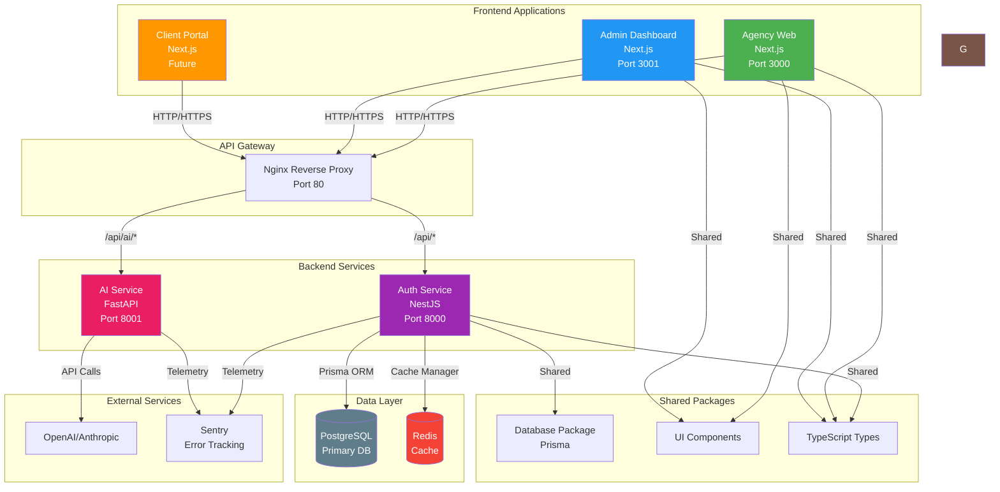
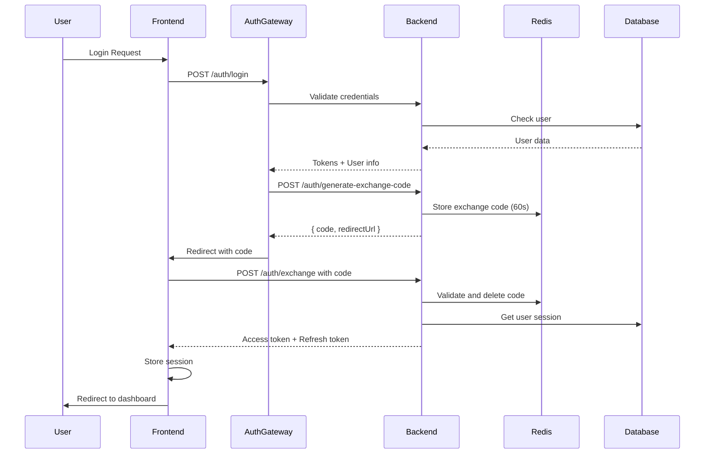
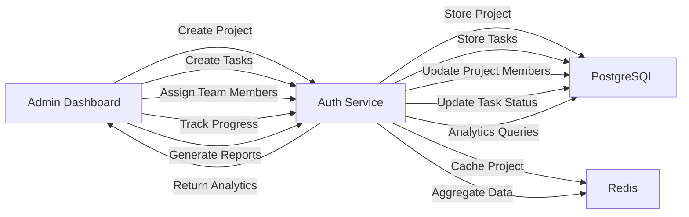
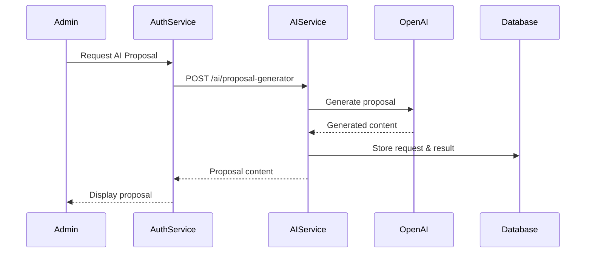
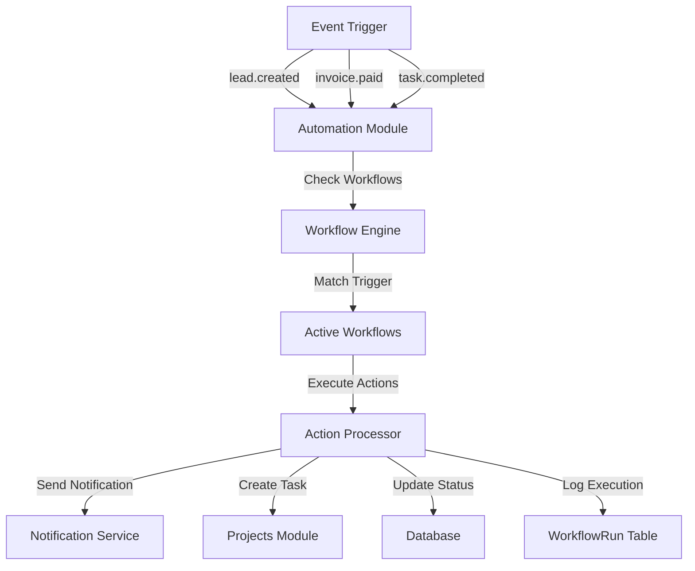
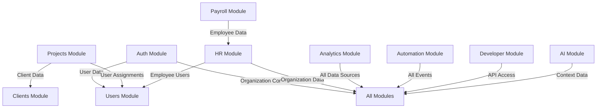
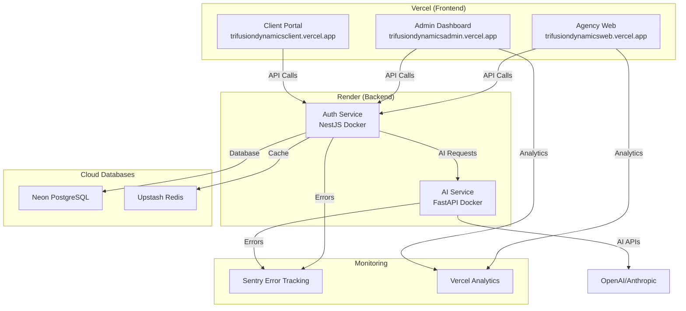
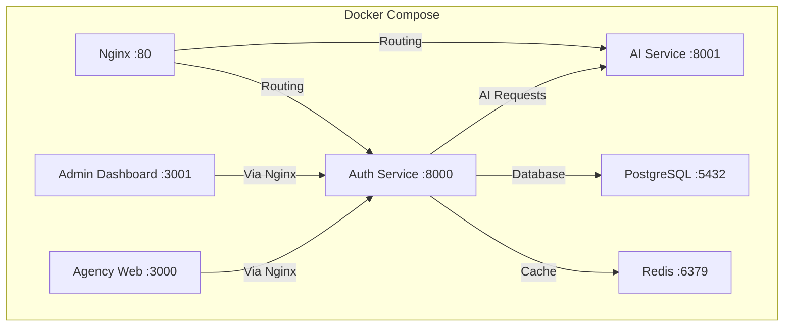

# AgencyOS - Complete System Architecture

## High-Level Architecture Diagram

## Detailed Service Architecture

### 1. Frontend Applications

#### Agency Web (Public Marketing Site)
- **Technology:** Next.js 15, React, TypeScript
- **Port:** 3000
- **Purpose:** Public marketing website with CMS
- **Features:**
  - Service pages and portfolio
  - Contact form lead generation
  - SEO optimization
  - Public API documentation

#### Admin Dashboard (Internal System)
- **Technology:** Next.js 15, React, TypeScript
- **Port:** 3001
- **Purpose:** Unified internal management system
- **Features:**
  - CRM and pipeline management
  - Project and task management
  - HR and payroll
  - Billing and finance
  - Analytics dashboards
  - AI tools integration
  - Automation workflows
  - Developer portal

#### Client Portal (Future)
- **Technology:** Next.js 15, React, TypeScript
- **Purpose:** Client-facing dashboard
- **Features:**
  - Project progress tracking
  - Invoice management
  - Document access
  - Support tickets

### 2. Backend Services

#### Auth Service (NestJS API Gateway)
- **Technology:** NestJS, TypeScript
- **Port:** 8000
- **Architecture:** Modular Monolith
- **Modules:**
  - **Auth Module:** JWT authentication, refresh tokens, exchange code pattern
  - **Users Module:** User management, role-based access control
  - **Projects Module:** Project, task, sprint, milestone management
  - **HR Module:** Employee management, attendance, leaves, recruitment
  - **Payroll Module:** Salary structures, payslip generation
  - **AI Module:** AI-powered features integration
  - **Analytics Module:** Revenue, client, team performance analytics
  - **Automation Module:** Event-driven workflows
  - **Developer Module:** API keys, webhooks, request logging
  - **Stubs Module:** API route placeholders

#### AI Service (FastAPI Microservice)
- **Technology:** FastAPI, Python
- **Port:** 8001
- **Purpose:** AI workload processing
- **Features:**
  - Proposal generation
  - SEO audits
  - Email writing
  - Meeting summarization
  - Conversational AI chat
- **Integrations:** OpenAI, Anthropic, Google Generative AI

### 3. Data Layer

#### PostgreSQL (Primary Database)
- **Technology:** PostgreSQL with pgvector extension
- **Port:** 5432
- **Schemas:**
  - `auth` - Users, roles, permissions, organizations
  - `cms` - Contact submissions, content management
  - `clients` - Client information, contacts
  - `crm` - Leads, pipeline stages, quotes
  - `projects` - Projects, tasks, sprints, milestones
  - `billing` - Invoices, payments, estimates, subscriptions
  - `hr` - Employees, leaves, recruitment
  - `payroll` - Salary structures, payslips, bank details
  - `ai` - AI requests, embeddings
  - `analytics` - Revenue rollups, client metrics, team performance
  - `automation` - Workflows, workflow runs
  - `developer` - API keys, request logs, webhooks

#### MongoDB (Currently Not Used)
- **Status:** Configured but not actively used in current implementation
- **Previous Purpose:** Auth activity logs, attendance punches, ticket messages
- **Current State:** MongoDB dependencies exist but functionality has been stubbed out
- **Note:** System currently uses PostgreSQL for all data storage

#### Redis (Cache Layer)
- **Technology:** Redis
- **Port:** 6379
- **Purpose:**
  - Session management
  - Exchange code storage (60-second expiry)
  - API response caching
  - Rate limiting
  - Real-time data

### 4. Shared Packages

#### Database Package (@agency-os/database)
- **Purpose:** Prisma schema and database utilities
- **Contains:**
  - Prisma schema with all database models
  - Database connection management
  - Seed data scripts
  - Migration scripts

#### UI Package (@agency-os/ui)
- **Purpose:** Shared React components
- **Contains:**
  - Reusable UI components
  - Styled components
  - Theme configuration

#### Types Package (@agency-os/types)
- **Purpose:** Shared TypeScript types
- **Contains:**
  - Interface definitions
  - Type guards
  - API response types

#### Config Package (@agency-os/config)
- **Purpose:** Shared configuration
- **Contains:**
  - Environment configuration
  - Constants
  - Utility functions

## Data Flow Diagrams

### Authentication Flow

### Project Management Flow

### AI Integration Flow

### Automation Workflow Flow

## Module Interconnections

### Auth Service Module Dependencies

## Deployment Architecture

### Production Deployment

### Local Development

## API Endpoints Overview

### Authentication Endpoints
- `POST /api/auth/login` - User login
- `POST /api/auth/logout` - User logout
- `POST /api/auth/refresh` - Refresh access token
- `GET /api/auth/me/activity` - Get user activity
- `POST /api/auth/generate-exchange-code` - Generate cross-domain code
- `POST /api/auth/exchange` - Exchange code for tokens

### Project Management Endpoints
- `POST /api/projects` - Create project
- `GET /api/projects` - List projects
- `GET /api/projects/{id}` - Get project details
- `PATCH /api/projects/{id}` - Update project
- `DELETE /api/projects/{id}` - Delete project
- `POST /api/projects/{id}/members` - Add team member
- `DELETE /api/projects/{id}/members/{userId}` - Remove member

### HR Endpoints
- `POST /api/hr/employees` - Create employee
- `GET /api/hr/employees` - List employees
- `GET /api/hr/employees/{id}` - Get employee details
- `PATCH /api/hr/employees/{id}` - Update employee
- `POST /api/hr/leaves` - Create leave request
- `GET /api/hr/leaves` - List leaves
- `PATCH /api/hr/leaves/{id}/review` - Review leave request
- `POST /api/hr/attendance/check-in` - Check in
- `POST /api/hr/attendance/check-out` - Check out
- `GET /api/hr/attendance/me/today` - Get today's status
- `POST /api/hr/recruitment` - Create recruitment entry
- `GET /api/hr/recruitment` - List recruitment entries
- `PATCH /api/hr/recruitment/{id}/stage` - Update recruitment stage

### AI Endpoints
- `POST /api/ai/proposal-generator` - Generate proposal
- `GET /api/ai/proposal-generator/history` - Get proposal history
- `POST /api/ai/seo-audit` - Perform SEO audit
- `GET /api/ai/seo-audit/history` - Get SEO audit history
- `POST /api/ai/email-writer` - Write email
- `POST /api/ai/meeting-summary` - Summarize meeting
- `POST /api/ai/chat` - AI chat

### Analytics Endpoints
- `GET /api/analytics/dashboard` - Get dashboard analytics
- `GET /api/analytics/revenue` - Get revenue trends
- `GET /api/analytics/clients` - Get client growth
- `GET /api/analytics/team-performance` - Get team performance
- `POST /api/analytics/rollup/run-now` - Run rollup job

### Automation Endpoints
- `POST /api/automation/workflows` - Create workflow
- `GET /api/automation/workflows` - List workflows
- `GET /api/automation/workflows/{id}` - Get workflow details
- `PATCH /api/automation/workflows/{id}` - Update workflow
- `PATCH /api/automation/workflows/{id}/toggle` - Toggle workflow
- `POST /api/automation/workflows/{id}/trigger` - Trigger workflow
- `GET /api/automation/workflows/{id}/runs` - Get workflow runs

### Developer Endpoints
- `POST /api/developer/api-keys` - Create API key
- `GET /api/developer/api-keys` - List API keys
- `DELETE /api/developer/api-keys/{id}` - Delete API key
- `POST /api/developer/webhooks` - Create webhook
- `GET /api/developer/webhooks` - List webhooks
- `PATCH /api/developer/webhooks/{id}/toggle` - Toggle webhook
- `GET /api/developer/webhooks/{id}/deliveries` - Get webhook deliveries
- `GET /api/developer/request-logs` - Get request logs

### Portal Endpoints (Client)
- `GET /api/portal/projects` - Get client projects
- `GET /api/portal/projects/{id}` - Get project details
- `GET /api/portal/invoices` - Get client invoices
- `GET /api/portal/invoices/{id}/pdf` - Get invoice PDF
- `GET /api/portal/documents` - Get documents
- `GET /api/portal/tickets` - Get support tickets
- `POST /api/portal/tickets` - Create support ticket
- `GET /api/portal/tickets/{id}/messages` - Get ticket messages

## Security Architecture

### Authentication Flow
- JWT-based authentication with HttpOnly cookies
- Refresh token rotation for enhanced security
- Exchange code pattern for cross-domain authentication
- Role-based access control (RBAC)
- Permission-based authorization

### Rate Limiting
- Global rate limiting: 100 requests/minute
- Per-endpoint rate limiting configuration
- Redis-backed rate limiting storage

### Data Protection
- Password hashing with bcrypt
- API key hashing with bcrypt
- HttpOnly cookies for sensitive tokens
- CORS configuration for allowed origins
- Helmet security headers

## Technology Stack Summary

| Layer | Technology | Purpose |
|-------|-----------|---------|
| Frontend | Next.js 15, React, TypeScript | Web applications |
| Backend API | NestJS, TypeScript | Main business logic |
| AI Service | FastAPI, Python | AI workloads |
| Database | PostgreSQL | Primary relational data |
| Cache | Redis | Caching & sessions |
| ORM | Prisma | Database abstraction |
| Monorepo | pnpm workspaces, Turborepo | Package management |
| Deployment | Vercel (frontend), Render (backend) | Cloud hosting |
| Monitoring | Sentry, Pino | Error tracking & logging |

## Key Features by Module

### Authentication & Security
- Secure login with JWT HttpOnly cookies
- Refresh token rotation
- Role-based access control
- Global rate limiting
- Helmet security headers

### CRM & Sales Pipeline
- Lead capture and management
- Visual sales pipeline stages
- Contact and organization management
- Lead conversion tracking
- Quote generation

### Project Management
- Project creation with client assignment
- Sprint and task management
- Kanban board support
- Milestone tracking
- Time logging

### HR & Workforce
- Employee profiles and directory
- Attendance check-in/check-out
- Leave request workflow
- Recruitment pipeline
- Employee document management

### Payroll & Finance
- Salary structure management
- Automated payslip generation
- Invoice creation and tracking
- Payment recording
- Expense management

### AI Platform
- Proposal generation
- SEO audits
- Email writing
- Meeting summarization
- Conversational AI chat

### Analytics & Reporting
- Revenue dashboards
- Client metrics
- Team performance
- Automated rollup jobs

### Automation Engine
- Event-driven workflows
- Conditional logic
- Scheduled execution
- Lifecycle event listeners

### Developer Tools
- API key management
- Webhook dispatchers
- Request logging
- Client-scoped API routes

This architecture provides a scalable, maintainable, and feature-rich platform for agency management operations.